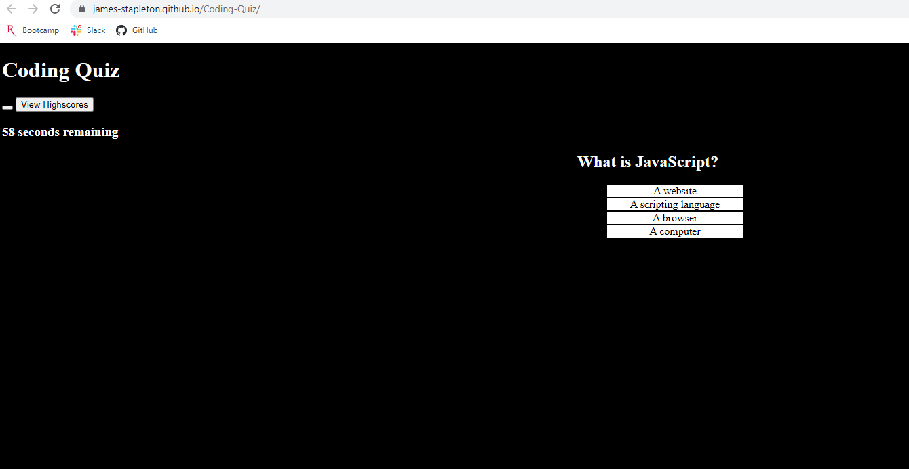

# Coding-Quiz

## Description

This is a webpage designed to administer a timed coding quiz. It uses an interval timer that it decremented if the user selects an incorrect answer choice. An array of objects is used to dynamically load the questions and answer choices onto the page as new HTML elements. The user's selection is compared against the answer key, outputting "correct" or "incorrect" and highlighting their selection green or red respectively. After a selection is made the timer pauses until the user hits the "next" button. When time runs out, or when all questions are answered, the game ends. Upon ending the player's score is presented and they are given the option to input their initials. Upon input, the scores stored in local storage are dispalyed and an option to clear the scores or play again is presented. 

## Link 

https://james-stapleton.github.io/Coding-Quiz/

## Screenshot

